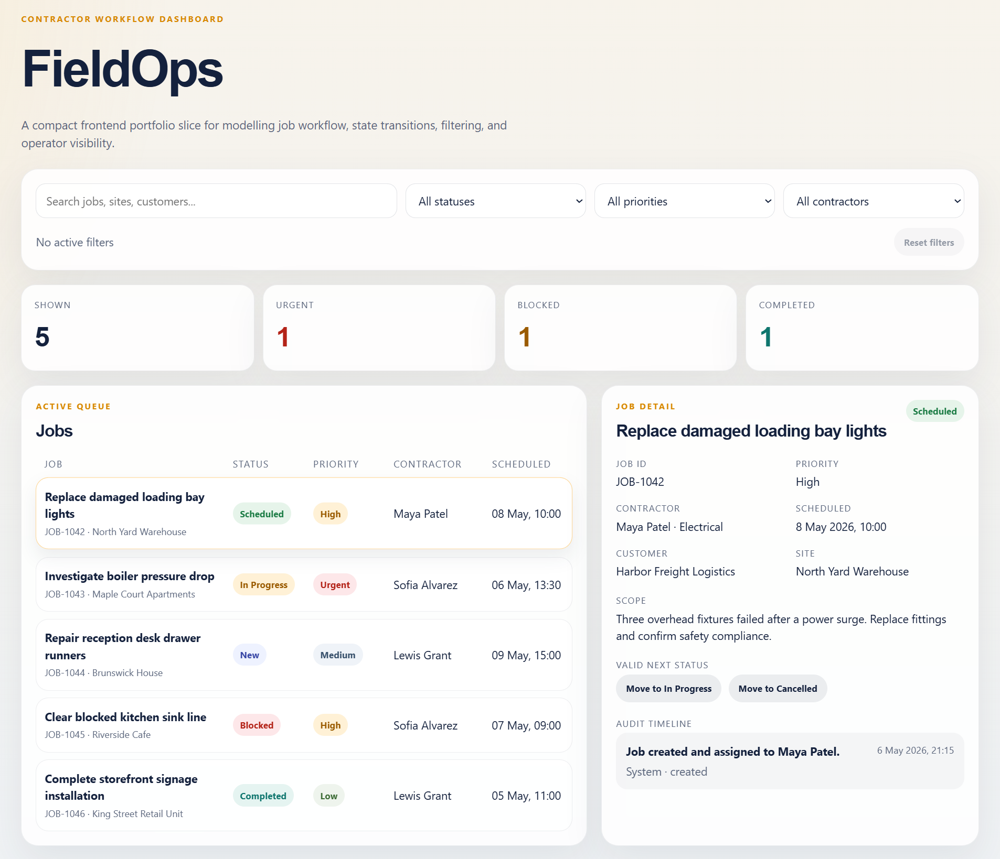
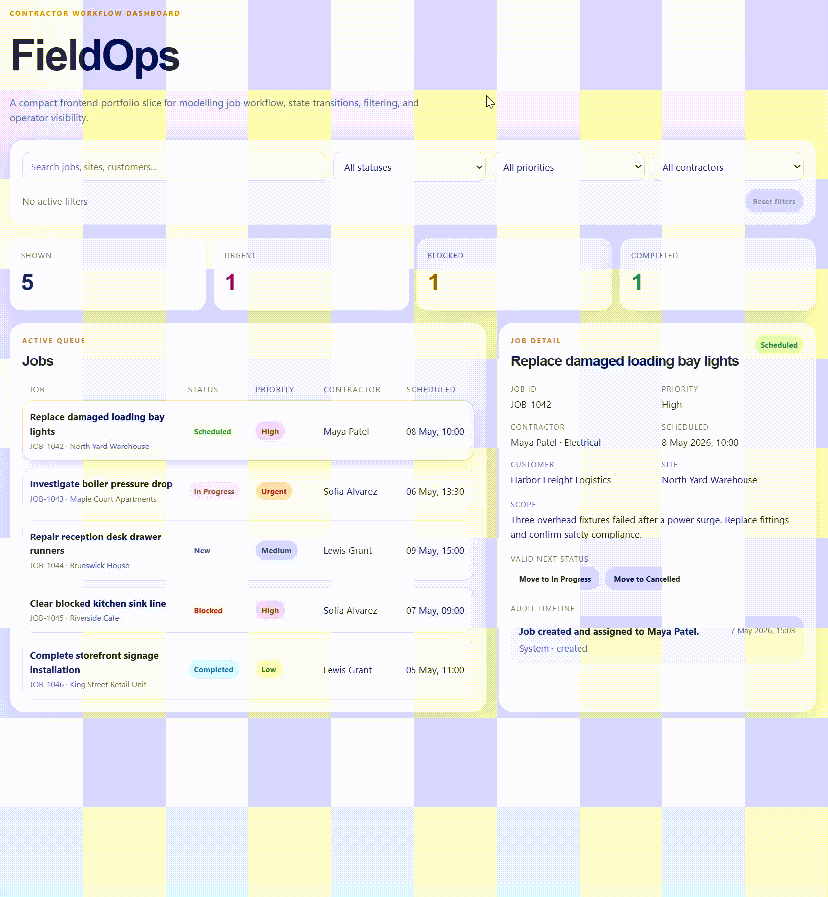

# FieldOps

[](https://github.com/markorankovic/FieldOps/actions/workflows/ci.yml)

FieldOps is a focused React + TypeScript portfolio project that models a contractor job workflow dashboard. It is designed to demonstrate product-minded frontend development around operational software: workflow state, valid transitions, filtering, audit history, and lightweight client-side persistence.



This is intentionally a frontend-only demo. There is no backend, authentication, or database layer yet.

## Live Demo

- Live demo: [https://gleeful-donut-55165c.netlify.app/](https://gleeful-donut-55165c.netlify.app/)
- CI workflow: [GitHub Actions](https://github.com/markorankovic/FieldOps/actions/workflows/ci.yml)

## Why I Built It

I built FieldOps to show how I approach real-world internal tools and workflow software, not just marketing sites or isolated UI components.

The goal was to create a compact, demoable app that reflects the kinds of product decisions a frontend engineer makes in operational systems:
- modelling workflow states clearly
- enforcing valid status transitions in the UI
- making filtered views easy to scan and act on
- preserving a simple audit trail of user-facing changes
- keeping the code typed, readable, and maintainable

## What It Does

FieldOps currently includes:
- a dashboard view of contractor jobs using mock data
- filters for status, priority, contractor, and free-text search
- active filter chips with one-click removal
- a reset filters action
- a job detail panel for the selected record
- valid workflow transitions only
- an audit timeline that updates when status changes
- summary metrics for the current filtered view
- empty-state handling when no jobs match filters
- `localStorage` persistence for filters and job status/audit changes



## Tech Stack

- React
- TypeScript
- Vite
- Vitest
- CSS

## Technical Decisions

### Frontend-only scope

This project deliberately avoids backend scope for now. The focus is on demonstrating frontend product thinking and maintainable state-driven UI, not infrastructure breadth.

### Typed domain model first

Core concepts such as jobs, statuses, priorities, filters, and audit entries are modelled explicitly in TypeScript. That keeps workflow logic and UI behavior aligned around the same definitions.

### Workflow rules are centralized

Allowed status transitions are implemented in domain logic rather than scattered through components. This keeps the UI simple and makes the transition rules easier to test and evolve.

### Persistence is small and local

Rather than introducing a backend prematurely, FieldOps uses a small typed `localStorage` helper to persist filter state and job changes across refreshes.

### Tests cover the highest-value logic

Tests are focused on the logic most likely to regress:
- workflow transitions
- audit updates
- filtering behavior
- persistence load/save fallback behavior

## Running Locally

### Prerequisites

- Node.js 20+ recommended
- npm

### Install dependencies

```bash
npm install
```

### Start the development server

```bash
npm run dev
```

Then open the local Vite URL shown in the terminal, typically `http://127.0.0.1:5173/`.

## Running Tests

```bash
npm test
```

## Building for Production

```bash
npm run build
```

The production-ready static assets are generated in `dist/`.

## Deployment Notes

FieldOps is a static Vite application, so it is straightforward to deploy on Vercel or Netlify without adding backend infrastructure.

### Vercel

- Framework preset: `Vite`
- Build command: `npm run build`
- Output directory: `dist`

### Netlify

- Build command: `npm run build`
- Publish directory: `dist`
- A minimal [netlify.toml](/home/marko/FieldOps/netlify.toml:1) is included for convenience

### CI

A minimal GitHub Actions workflow is included at [.github/workflows/ci.yml](/home/marko/FieldOps/.github/workflows/ci.yml:1). It runs:
- `npm ci`
- `npm test`
- `npm run build`

## What I Would Improve With More Time

- split styling into component-level files for easier long-term maintenance
- add a simple Dockerfile for consistent local/demo setup
- improve accessibility details such as keyboard interaction polish and screen reader cues
- expand the workflow model with assignment changes, notes, or richer timeline events

## Positioning

FieldOps is best described as a focused portfolio demo, not a production-ready field operations platform.

It is intended to show:
- product-focused frontend development
- workflow and state modelling
- typed React application structure
- practical UI behavior for operational software
- clean, maintainable implementation choices
